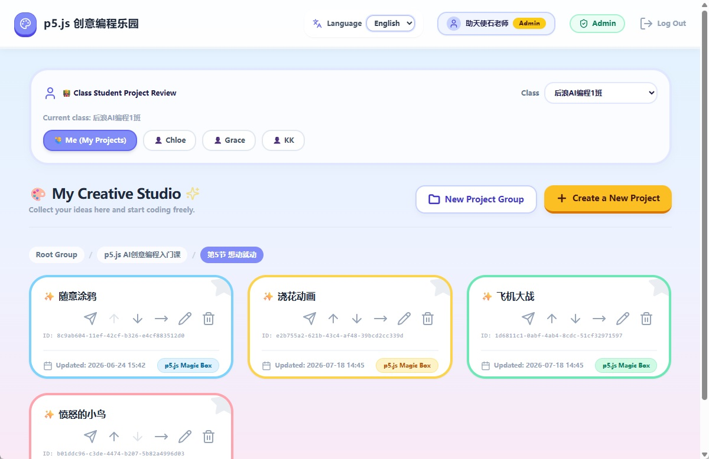
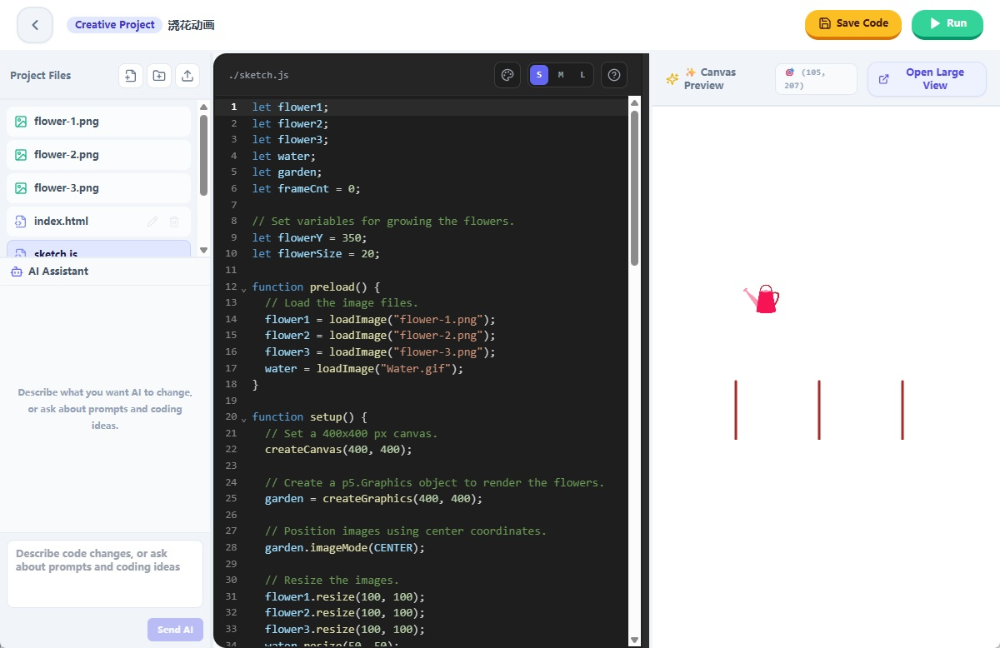
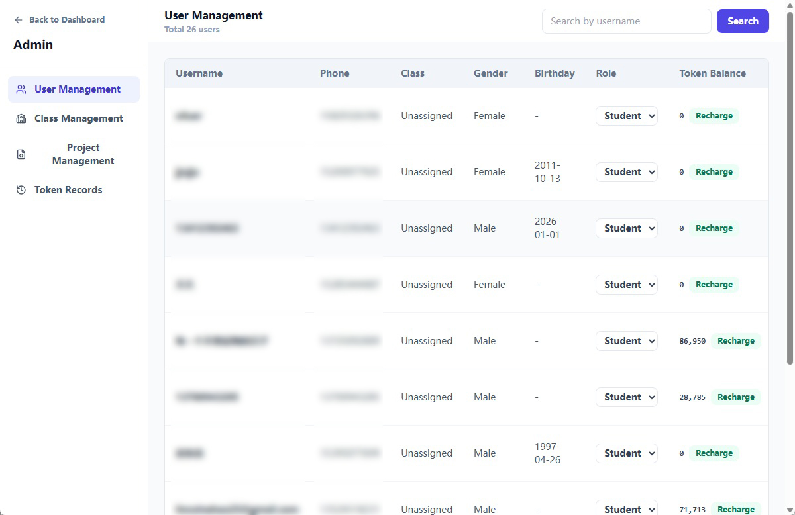

# teaching-p5js

中文版：[README.md](./README.md)

> Version: 1.0.0

`teaching-p5js` is an online practice platform for teaching creative coding with p5.js. Students can register, sign in, create and organize projects, edit files such as `index.html`, `sketch.js`, and `style.css`, and preview their work in the browser. Teachers can review projects from students in their classes, copy good examples, and distribute template projects to a class. Administrators can manage users, classes, projects, and AI Token balances.

## Features

- User registration and login: JWT-based API authentication, with profile, phone number, gender, birthday, class code, and password management.
- Slider captcha and SMS verification: registration and phone updates require a slider challenge and Aliyun SMS code verification, with send-frequency logs.
- Student project management: create, rename, delete, copy, move, and reorder p5.js projects.
- Project group management: nested project groups, breadcrumbs, sorting, and moving between groups.
- Online code editing: CodeMirror-based editing for HTML, JavaScript, CSS, and TXT files.
- File tree and asset management: create text files, create folders, upload assets such as images/audio/video, rename entries, and delete entries.
- Live preview: text files are saved before running, then previewed in an iframe or a separate browser window.
- Teacher review workflow: teachers and admins can view students in their assigned classes and open student projects in read-only mode.
- Project distribution: teachers can copy one of their own projects to every student in a selected class.
- Admin dashboard: admins can page through users, update student/teacher roles, recharge AI Tokens, inspect Token transactions, manage classes, and view all projects.
- AI code assistant: authenticated users can spend Tokens to request Gemini-compatible p5.js code suggestions, optionally with up to 3 reference images.
- Local file storage: project metadata is stored in MySQL, while real project files live under `backend/storage/projects/<project-id>/`.

## Screenshots

### Dashboard



### Online Editor



### Admin Dashboard



## Tech Stack

### Frontend

- React 18
- Vite 5
- React Router 6
- Tailwind CSS
- CodeMirror 6
- lucide-react
- react-split

### Backend

- Node.js
- Express
- MySQL 8
- mysql2
- bcryptjs
- jsonwebtoken
- dotenv
- Aliyun SMS service
- Gemini-compatible AI API

## Project Structure

```text
teaching-p5js/
├── backend/
│   ├── app.js
│   ├── package.json
│   ├── config/
│   │   └── db.js
│   ├── controllers/
│   │   ├── adminController.js
│   │   ├── aiController.js
│   │   ├── authController.js
│   │   ├── fileController.js
│   │   ├── projectController.js
│   │   └── projectGroupController.js
│   ├── middleware/
│   │   ├── adminMiddleware.js
│   │   ├── authMiddleware.js
│   │   └── securityMiddleware.js
│   ├── models/
│   │   ├── classModel.js
│   │   ├── fileModel.js
│   │   ├── projectGroupModel.js
│   │   ├── projectModel.js
│   │   ├── tokenTransactionModel.js
│   │   ├── userModel.js
│   │   └── verificationModel.js
│   ├── routes/
│   │   ├── admin.js
│   │   ├── ai.js
│   │   ├── auth.js
│   │   ├── files.js
│   │   ├── projectGroups.js
│   │   └── projects.js
│   ├── services/
│   │   └── smsService.js
│   └── storage/
│       └── projects/
├── frontend/
│   ├── index.html
│   ├── package.json
│   ├── vite.config.js
│   ├── public/
│   │   └── libs/
│   │       ├── p5-1.11.13.min.js
│   │       └── p5.sound-1.0.1.min.js
│   └── src/
│       ├── App.jsx
│       ├── main.jsx
│       ├── components/
│       ├── context/
│       ├── hooks/
│       ├── i18n/
│       ├── pages/
│       └── services/
├── docs/
│   └── images/
│       ├── admin-en.jpg
│       ├── dashboard-en.jpg
│       └── editor-en.jpg
├── setup_project.sh
├── README-en.md
└── README.md
```

## Requirements

- Node.js 18 or newer
- npm
- MySQL 8.x
- Optional: Aliyun SMS configuration
- Optional: Gemini-compatible API key

## Quick Start

### 1. Install Dependencies

Backend:

```bash
cd backend
npm install
```

Frontend:

```bash
cd ../frontend
npm install
```

### 2. Configure Backend Environment Variables

Create `backend/.env`:

```env
NODE_ENV=development
PORT=5000
FRONTEND_URL=http://localhost:5173

DB_HOST=127.0.0.1
DB_PORT=3306
DB_USER=your_mysql_user
DB_PASSWORD=your_mysql_password
DB_NAME=teaching_p5js

JWT_SECRET=replace_with_a_strong_secret

GEMINI_API_KEY=your_gemini_api_key
GEMINI_BASE_URL=https://relay_server_url
GEMINI_MODEL=gemini-3.5-flash
GEMINI_MAX_OUTPUT_TOKENS=24576

ALIYUN_ACCESS_KEY_ID=your_aliyun_access_key_id
ALIYUN_ACCESS_KEY_SECRET=your_aliyun_access_key_secret
ALIYUN_SMS_ENDPOINT=dypnsapi.aliyuncs.com
ALIYUN_SMS_REGION_ID=cn-shanghai
ALIYUN_SMS_SCHEME_NAME=your_scheme_name
ALIYUN_SMS_COUNTRY_CODE=86
ALIYUN_SMS_SIGN_NAME=your_sms_sign_name
ALIYUN_SMS_TEMPLATE_CODE=your_sms_template_code
ALIYUN_SMS_TEMPLATE_PARAM_NAME=code
ALIYUN_SMS_TEMPLATE_CODE_PLACEHOLDER=##code##
ALIYUN_SMS_TEMPLATE_MINUTE_PARAM_NAME=min
ALIYUN_SMS_TEMPLATE_MINUTE_VALUE=5
```

### 3. Initialize the Database

Create the database first:

```sql
CREATE DATABASE teaching_p5js
  DEFAULT CHARACTER SET utf8mb4
  DEFAULT COLLATE utf8mb4_unicode_ci;
```

Then run the table-creation SQL below. This schema is based on the current code and the provided initialization SQL. It covers users, classes, projects, project groups, files, captcha challenges, SMS logs, and Token transactions.

```sql
CREATE TABLE `users` (
  `id` int NOT NULL AUTO_INCREMENT,
  `username` varchar(50) NOT NULL,
  `phone` varchar(20) DEFAULT NULL,
  `class_code` varchar(20) DEFAULT NULL,
  `gender` enum('male','female') DEFAULT NULL,
  `birthday` date DEFAULT NULL,
  `password_hash` varchar(255) NOT NULL,
  `role` varchar(20) NOT NULL DEFAULT 'student',
  `created_at` timestamp NULL DEFAULT CURRENT_TIMESTAMP,
  `updated_at` timestamp NULL DEFAULT CURRENT_TIMESTAMP ON UPDATE CURRENT_TIMESTAMP,
  `tokens` int NOT NULL DEFAULT '0',
  PRIMARY KEY (`id`),
  UNIQUE KEY `username` (`username`),
  KEY `idx_username` (`username`),
  KEY `idx_users_class_code` (`class_code`)
) ENGINE=InnoDB DEFAULT CHARSET=utf8mb4 COLLATE=utf8mb4_0900_ai_ci;

CREATE TABLE `classes` (
  `id` int NOT NULL AUTO_INCREMENT,
  `name` varchar(100) NOT NULL,
  `class_code` varchar(10) NOT NULL,
  `teacher_user_id` int NOT NULL,
  `created_at` timestamp NULL DEFAULT CURRENT_TIMESTAMP,
  `updated_at` timestamp NULL DEFAULT CURRENT_TIMESTAMP ON UPDATE CURRENT_TIMESTAMP,
  PRIMARY KEY (`id`),
  UNIQUE KEY `class_code` (`class_code`),
  KEY `idx_classes_teacher_user_id` (`teacher_user_id`),
  CONSTRAINT `fk_classes_teacher` FOREIGN KEY (`teacher_user_id`) REFERENCES `users` (`id`)
) ENGINE=InnoDB DEFAULT CHARSET=utf8mb4 COLLATE=utf8mb4_0900_ai_ci;

CREATE TABLE `project_groups` (
  `id` int NOT NULL AUTO_INCREMENT,
  `user_id` int NOT NULL,
  `name` varchar(100) NOT NULL,
  `parent_id` int DEFAULT NULL,
  `sort_order` int NOT NULL DEFAULT '0',
  `created_at` timestamp NULL DEFAULT CURRENT_TIMESTAMP,
  `updated_at` timestamp NULL DEFAULT CURRENT_TIMESTAMP ON UPDATE CURRENT_TIMESTAMP,
  PRIMARY KEY (`id`),
  KEY `fk_project_groups_parent` (`parent_id`),
  KEY `idx_project_groups_user_parent` (`user_id`,`parent_id`),
  CONSTRAINT `fk_project_groups_parent` FOREIGN KEY (`parent_id`) REFERENCES `project_groups` (`id`) ON DELETE CASCADE,
  CONSTRAINT `fk_project_groups_user` FOREIGN KEY (`user_id`) REFERENCES `users` (`id`) ON DELETE CASCADE
) ENGINE=InnoDB DEFAULT CHARSET=utf8mb4 COLLATE=utf8mb4_0900_ai_ci;

CREATE TABLE `projects` (
  `id` varchar(36) NOT NULL,
  `user_id` int NOT NULL,
  `name` varchar(100) NOT NULL DEFAULT '未命名项目',
  `created_at` timestamp NULL DEFAULT CURRENT_TIMESTAMP,
  `updated_at` timestamp NULL DEFAULT CURRENT_TIMESTAMP ON UPDATE CURRENT_TIMESTAMP,
  `parent_id` int DEFAULT NULL,
  `sort_order` int NOT NULL DEFAULT '0',
  PRIMARY KEY (`id`),
  KEY `idx_user_id` (`user_id`),
  KEY `fk_projects_parent_group` (`parent_id`),
  KEY `idx_projects_user_parent` (`user_id`,`parent_id`),
  CONSTRAINT `fk_projects_parent_group` FOREIGN KEY (`parent_id`) REFERENCES `project_groups` (`id`) ON DELETE SET NULL,
  CONSTRAINT `fk_projects_user` FOREIGN KEY (`user_id`) REFERENCES `users` (`id`) ON DELETE CASCADE
) ENGINE=InnoDB DEFAULT CHARSET=utf8mb4 COLLATE=utf8mb4_0900_ai_ci;

CREATE TABLE `files` (
  `id` int NOT NULL AUTO_INCREMENT,
  `project_id` varchar(36) NOT NULL,
  `name` varchar(100) NOT NULL,
  `path` varchar(255) NOT NULL,
  `created_at` timestamp NULL DEFAULT CURRENT_TIMESTAMP,
  `updated_at` timestamp NULL DEFAULT CURRENT_TIMESTAMP ON UPDATE CURRENT_TIMESTAMP,
  PRIMARY KEY (`id`),
  UNIQUE KEY `uk_project_file_path` (`project_id`,`path`),
  CONSTRAINT `fk_files_project` FOREIGN KEY (`project_id`) REFERENCES `projects` (`id`) ON DELETE CASCADE
) ENGINE=InnoDB DEFAULT CHARSET=utf8mb4 COLLATE=utf8mb4_0900_ai_ci;

CREATE TABLE `captcha_challenges` (
  `id` int NOT NULL AUTO_INCREMENT,
  `challenge_id` char(36) NOT NULL,
  `target_x` int NOT NULL,
  `expires_at` datetime NOT NULL,
  `verified_at` datetime DEFAULT NULL,
  `used_at` datetime DEFAULT NULL,
  `captcha_token_hash` char(64) DEFAULT NULL,
  `token_expires_at` datetime DEFAULT NULL,
  `created_at` timestamp NULL DEFAULT CURRENT_TIMESTAMP,
  PRIMARY KEY (`id`),
  UNIQUE KEY `challenge_id` (`challenge_id`),
  KEY `idx_captcha_token_hash` (`captcha_token_hash`),
  KEY `idx_captcha_expires_at` (`expires_at`)
) ENGINE=InnoDB DEFAULT CHARSET=utf8mb4 COLLATE=utf8mb4_0900_ai_ci;

CREATE TABLE `sms_send_logs` (
  `id` int NOT NULL AUTO_INCREMENT,
  `phone` varchar(20) NOT NULL,
  `ip_address` varchar(64) NOT NULL,
  `purpose` enum('register','update_phone') NOT NULL,
  `sent_at` timestamp NULL DEFAULT CURRENT_TIMESTAMP,
  PRIMARY KEY (`id`),
  KEY `idx_sms_phone_sent_at` (`phone`,`sent_at`),
  KEY `idx_sms_ip_sent_at` (`ip_address`,`sent_at`)
) ENGINE=InnoDB DEFAULT CHARSET=utf8mb4 COLLATE=utf8mb4_0900_ai_ci;

CREATE TABLE `token_transactions` (
  `id` bigint unsigned NOT NULL AUTO_INCREMENT,
  `user_id` int NOT NULL,
  `type` enum('recharge','consume') NOT NULL,
  `amount` bigint NOT NULL,
  `balance_before` bigint NOT NULL,
  `balance_after` bigint NOT NULL,
  `operator_user_id` int DEFAULT NULL,
  `detail` json DEFAULT NULL,
  `created_at` timestamp NOT NULL DEFAULT CURRENT_TIMESTAMP,
  PRIMARY KEY (`id`),
  KEY `idx_token_transactions_user_created_at` (`user_id`,`created_at`),
  KEY `idx_token_transactions_type_created_at` (`type`,`created_at`),
  KEY `fk_token_transactions_operator` (`operator_user_id`),
  CONSTRAINT `fk_token_transactions_operator` FOREIGN KEY (`operator_user_id`) REFERENCES `users` (`id`) ON DELETE SET NULL,
  CONSTRAINT `fk_token_transactions_user` FOREIGN KEY (`user_id`) REFERENCES `users` (`id`) ON DELETE CASCADE
) ENGINE=InnoDB DEFAULT CHARSET=utf8mb4 COLLATE=utf8mb4_0900_ai_ci;
```

To create an admin or teacher account, register a normal user first, then update its role in the database:

```sql
UPDATE users SET role = 'admin' WHERE username = 'admin_username';
UPDATE users SET role = 'teacher' WHERE username = 'teacher_username';
```

### 4. Start the Backend

```bash
cd backend
npm run dev
```

The backend runs at:

```text
http://localhost:5000
```

Health check:

```text
GET /api/health
```

### 5. Start the Frontend

```bash
cd frontend
npm run dev
```

The frontend runs at:

```text
http://localhost:5173/teaching-p5js/
```

`frontend/vite.config.js` already proxies API requests in development:

```js
server: {
  proxy: {
    '/api': 'http://localhost:5000'
  }
}
```

## Common Scripts

Backend:

```bash
npm start
npm run dev
```

Frontend:

```bash
npm run dev
npm run build
npm run preview
```

## API Overview

Except for registration, login, captcha, SMS verification, and health checks, business APIs require:

```text
Authorization: Bearer <token>
```

### Authentication and Profile

| Method | Path | Description |
| --- | --- | --- |
| `POST` | `/api/auth/captcha/challenge` | Create a slider captcha challenge |
| `POST` | `/api/auth/captcha/verify` | Verify the slider position and return an SMS precondition token |
| `POST` | `/api/auth/sms-code` | Send a registration SMS code |
| `POST` | `/api/auth/register` | Register a student account |
| `POST` | `/api/auth/login` | Log in and receive a JWT |
| `GET` | `/api/auth/me` | Get the current user profile |
| `POST` | `/api/auth/me/sms-code` | Send an SMS code before changing phone number |
| `PUT` | `/api/auth/me` | Update the current user profile |
| `PUT` | `/api/auth/me/password` | Change the current user's password |
| `GET` | `/api/auth/students` | Teacher/admin: list visible students |
| `GET` | `/api/auth/my-classes` | Teacher/admin: list classes managed by the current user |
| `GET` | `/api/auth/classes/:classCode/students` | Teacher/admin: list students in a class |

### Projects

| Method | Path | Description |
| --- | --- | --- |
| `GET` | `/api/projects` | List current user's projects, optionally filtered by `parentId` |
| `GET` | `/api/projects?studentId=<id>` | Teacher/admin: list visible student projects |
| `POST` | `/api/projects` | Create a project and default files |
| `POST` | `/api/projects/copy` | Copy an accessible project to the current user |
| `POST` | `/api/projects/:id/copy` | Copy a specified project to the current user |
| `POST` | `/api/projects/:id/distribute-to-class` | Teacher: distribute a project to class students |
| `PUT` | `/api/projects/reorder` | Reorder projects in the current directory |
| `GET` | `/api/projects/:id` | Get project details and edit permission |
| `PUT` | `/api/projects/:id` | Rename a project |
| `PUT` | `/api/projects/:id/move` | Move a project into another project group |
| `DELETE` | `/api/projects/:id` | Delete a project and its physical files |

### Project Groups

| Method | Path | Description |
| --- | --- | --- |
| `GET` | `/api/project-groups` | List groups and breadcrumbs, optionally using `parentId` / `studentId` |
| `GET` | `/api/project-groups/all` | List all project groups for the current user |
| `POST` | `/api/project-groups` | Create a project group |
| `PUT` | `/api/project-groups/reorder` | Reorder project groups |
| `PUT` | `/api/project-groups/:id` | Rename a project group |
| `PUT` | `/api/project-groups/:id/move` | Move a project group |
| `DELETE` | `/api/project-groups/:id` | Delete an empty project group |

### Files

| Method | Path | Description |
| --- | --- | --- |
| `GET` | `/api/files/project/:projectId` | Get the project file tree, text content, and asset URLs |
| `POST` | `/api/files/project/:projectId` | Create a text file or folder |
| `POST` | `/api/files/project/:projectId/upload` | Upload an asset file |
| `PATCH` | `/api/files/:id/rename` | Rename a file or folder |
| `PUT` | `/api/files/:id` | Save text file content |
| `DELETE` | `/api/files/:id` | Delete a file or folder |

### AI

| Method | Path | Description |
| --- | --- | --- |
| `POST` | `/api/ai/project/:projectId/code` | Request AI code suggestions and deduct Tokens based on usage |

### Admin

| Method | Path | Description |
| --- | --- | --- |
| `GET` | `/api/admin/users` | Page through users |
| `PUT` | `/api/admin/users/:id/role` | Update a user role, limited to student/teacher |
| `POST` | `/api/admin/users/:id/tokens/recharge` | Recharge AI Tokens for a user |
| `PATCH` | `/api/admin/users/:id/tokens/recharge` | Recharge AI Tokens for a user |
| `GET` | `/api/admin/token-transactions` | Page through Token transactions |
| `GET` | `/api/admin/projects` | Page through all projects |
| `GET` | `/api/admin/teachers` | List teachers |
| `GET` | `/api/admin/classes` | Page through classes |
| `POST` | `/api/admin/classes` | Create a class |
| `GET` | `/api/admin/classes/:id/students` | List students in a class |
| `DELETE` | `/api/admin/classes/:id/students/:studentId` | Remove a student from a class |
| `PUT` | `/api/admin/classes/:id` | Update a class |
| `DELETE` | `/api/admin/classes/:id` | Delete a class and clear class codes from its students |

## Project File Template

When a new project is created, the backend creates a UUID directory and writes these default files:

- `index.html`
- `sketch.js`
- `style.css`

Physical file location:

```text
backend/storage/projects/<project-id>/
```

Static URL:

```text
/teaching-p5js/projects/<project-id>/index.html
```

The default `index.html` uses the bundled p5.js library:

```html
<script src="/teaching-p5js/libs/p5-1.11.13.min.js"></script>
```

## Data Model Relationships

- `users` is the central user table. `role` distinguishes `student`, `teacher`, and `admin`; `tokens` stores the user's AI balance.
- `classes` binds to a teacher through `teacher_user_id`, and links students through the unique `class_code` stored in `users.class_code`.
- `projects` belongs to a user through `user_id`, and can be placed inside a `project_groups` entry through `parent_id`.
- `project_groups` supports a per-user nested tree through its self-referencing `parent_id`.
- `files` stores file/folder metadata for each project. Actual content is stored on disk.
- `captcha_challenges` stores slider captcha challenges, verification status, and one-time SMS precondition tokens.
- `sms_send_logs` records phone/IP SMS send events for rate limiting.
- `token_transactions` records admin recharges and AI consumption so balance changes can be audited.

## Frontend Routes

The frontend uses `BrowserRouter` with the base path `/teaching-p5js`:

| Path | Description |
| --- | --- |
| `/teaching-p5js/login` | Login and registration page |
| `/teaching-p5js/dashboard` | Student/teacher project dashboard |
| `/teaching-p5js/editor/:projectId` | Online editor and preview page |
| `/teaching-p5js/admin` | Admin dashboard, available to admins only |

Login-related state is stored in `localStorage`:

- `teaching_token`
- `teaching_user`
- `teaching_language`
- `teaching_editor_code_font_size`

## Build and Deployment

Build the frontend:

```bash
cd frontend
npm run build
```

Build output:

```text
frontend/dist/
```

Run the backend in production:

```bash
cd backend
npm start
```

Deployment notes:

- Use a strong random value for `JWT_SECRET`.
- Do not commit real `.env` files to a public repository.
- Configure HTTPS.
- Reverse proxy `/api` to the backend service.
- Serve `/teaching-p5js/` from the frontend build output.
- Ensure `backend/storage/projects` is writable.
- Back up the MySQL database and `backend/storage/projects` regularly.
- Before enabling SMS in production, confirm that the Aliyun SMS template and signature are approved.
- Before enabling AI features, confirm `GEMINI_API_KEY`, `GEMINI_BASE_URL`, `GEMINI_MODEL`, and the Token recharge workflow.

## Notes

- The project does not include a database migration tool. First-time deployment requires manually creating the database and tables.
- The `files` table stores metadata only; file content is stored as physical files.
- `index.html` cannot be deleted or renamed through file management, so the project preview entry point remains stable.
- Teachers open student projects in read-only mode by default; copying a student project creates a new project owned by the teacher.
- The AI code assistant may only modify `index.html`, `style.css`, and `sketch.js`, and it expects JSON-formatted suggestions.

## License

This project is open sourced under the MIT License. See [LICENSE](./LICENSE) for details.
