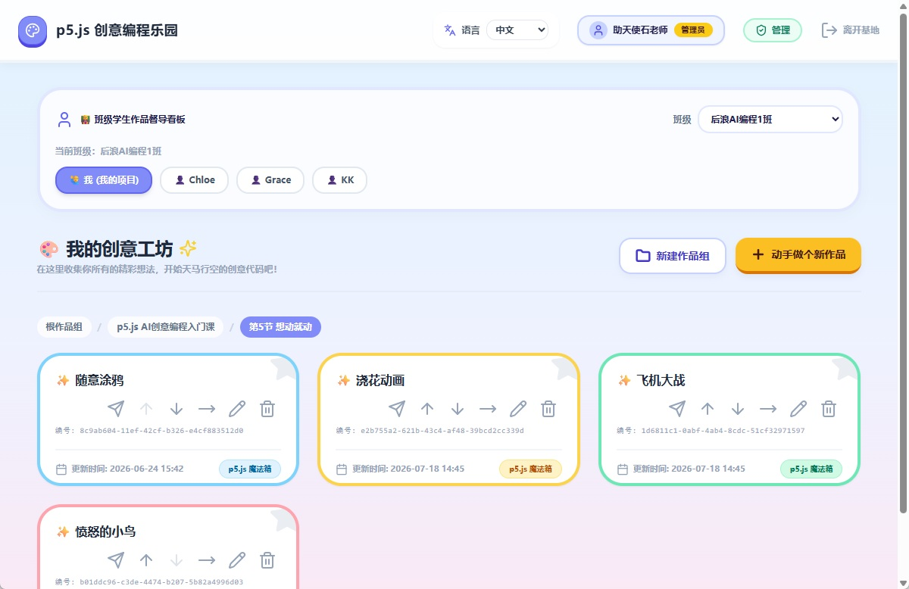
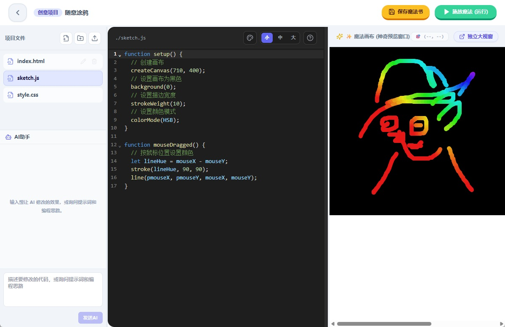
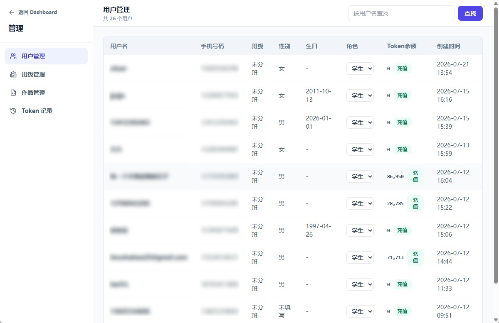

# teaching-p5js

English version: [README-en.md](./README-en.md)

> 版本：1.0.0

`teaching-p5js` 是一个面向 p5.js 创意编程教学的在线练习平台。学生可以注册登录、创建和管理作品、在线编辑 `index.html` / `sketch.js` / `style.css` 等项目文件，并在浏览器中实时运行预览；教师可以查看自己班级下的学生作品、复制优秀作品、向班级分发模板项目；管理员可以管理用户、班级、作品和 AI Token。

## 功能概览

- 用户注册与登录：基于 JWT 的接口认证，支持个人资料、手机号、性别、生日、班级码和密码维护。
- 滑块验证码与短信验证码：注册、修改手机号前需要完成滑块验证和阿里云短信验证码校验，并记录发送频率。
- 学生作品管理：创建、重命名、删除、复制、移动、排序 p5.js 作品。
- 作品分组管理：支持多级作品组、面包屑导航、组内排序和移动。
- 在线代码编辑：基于 CodeMirror，支持 HTML、JavaScript、CSS、TXT 文本文件编辑。
- 文件树与资源管理：支持创建文本文件、创建文件夹、上传图片/音频/视频等资源、重命名和删除文件。
- 实时预览：运行时自动保存文本文件，通过 iframe 或独立窗口预览 p5.js 作品。
- 教师督导：教师/管理员可查看绑定班级的学生列表和学生项目，以只读方式进入作品。
- 项目分发：教师可将自己的项目批量复制到当前班级的学生账户下。
- 管理后台：管理员可分页查询用户、调整学生/教师角色、给用户充值 AI Token、查看 Token 流水、管理班级、查看全站作品。
- AI 代码助手：已登录用户可消耗 Token 调用 Gemini 兼容接口生成 p5.js 代码修改建议，支持最多 3 张图片作为参考。
- 本地物理文件存储：项目文件元数据写入 MySQL，真实文件保存在 `backend/storage/projects/<project-id>/`。

## 界面预览

### 作品工作台



### 在线编辑器



### 管理后台



## 技术栈

### 前端

- React 18
- Vite 5
- React Router 6
- Tailwind CSS
- CodeMirror 6
- lucide-react
- react-split

### 后端

- Node.js
- Express
- MySQL 8
- mysql2
- bcryptjs
- jsonwebtoken
- dotenv
- 阿里云短信服务
- Gemini 兼容 AI 接口

## 项目结构

```text
teaching-p5js/
├── backend/
│   ├── app.js
│   ├── package.json
│   ├── config/
│   │   └── db.js
│   ├── controllers/
│   │   ├── adminController.js
│   │   ├── aiController.js
│   │   ├── authController.js
│   │   ├── fileController.js
│   │   ├── projectController.js
│   │   └── projectGroupController.js
│   ├── middleware/
│   │   ├── adminMiddleware.js
│   │   ├── authMiddleware.js
│   │   └── securityMiddleware.js
│   ├── models/
│   │   ├── classModel.js
│   │   ├── fileModel.js
│   │   ├── projectGroupModel.js
│   │   ├── projectModel.js
│   │   ├── tokenTransactionModel.js
│   │   ├── userModel.js
│   │   └── verificationModel.js
│   ├── routes/
│   │   ├── admin.js
│   │   ├── ai.js
│   │   ├── auth.js
│   │   ├── files.js
│   │   ├── projectGroups.js
│   │   └── projects.js
│   ├── services/
│   │   └── smsService.js
│   └── storage/
│       └── projects/
├── frontend/
│   ├── index.html
│   ├── package.json
│   ├── vite.config.js
│   ├── public/
│   │   └── libs/
│   │       ├── p5-1.11.13.min.js
│   │       └── p5.sound-1.0.1.min.js
│   └── src/
│       ├── App.jsx
│       ├── main.jsx
│       ├── components/
│       ├── context/
│       ├── hooks/
│       ├── i18n/
│       ├── pages/
│       └── services/
├── docs/
│   └── images/
│       ├── admin.jpg
│       ├── dashboard.jpg
│       └── editor.jpg
├── setup_project.sh
├── README-en.md
└── README.md
```

## 环境要求

- Node.js 18 或更高版本
- npm
- MySQL 8.x
- 可选：阿里云短信服务配置
- 可选：Gemini 兼容接口密钥

## 快速开始

### 1. 安装依赖

后端：

```bash
cd backend
npm install
```

前端：

```bash
cd ../frontend
npm install
```

### 2. 配置后端环境变量

在 `backend/.env` 中配置：

```env
NODE_ENV=development
PORT=5000
FRONTEND_URL=http://localhost:5173

DB_HOST=127.0.0.1
DB_PORT=3306
DB_USER=your_mysql_user
DB_PASSWORD=your_mysql_password
DB_NAME=teaching_p5js

JWT_SECRET=replace_with_a_strong_secret

GEMINI_API_KEY=your_gemini_api_key
GEMINI_BASE_URL=https://relay.tigao123.top
GEMINI_MODEL=gemini-3.5-flash
GEMINI_MAX_OUTPUT_TOKENS=24576

ALIYUN_ACCESS_KEY_ID=your_aliyun_access_key_id
ALIYUN_ACCESS_KEY_SECRET=your_aliyun_access_key_secret
ALIYUN_SMS_ENDPOINT=dypnsapi.aliyuncs.com
ALIYUN_SMS_REGION_ID=cn-shanghai
ALIYUN_SMS_SCHEME_NAME=your_scheme_name
ALIYUN_SMS_COUNTRY_CODE=86
ALIYUN_SMS_SIGN_NAME=your_sms_sign_name
ALIYUN_SMS_TEMPLATE_CODE=your_sms_template_code
ALIYUN_SMS_TEMPLATE_PARAM_NAME=code
ALIYUN_SMS_TEMPLATE_CODE_PLACEHOLDER=##code##
ALIYUN_SMS_TEMPLATE_MINUTE_PARAM_NAME=min
ALIYUN_SMS_TEMPLATE_MINUTE_VALUE=5
```

### 3. 初始化数据库

先创建数据库：

```sql
CREATE DATABASE teaching_p5js
  DEFAULT CHARACTER SET utf8mb4
  DEFAULT COLLATE utf8mb4_unicode_ci;
```

再执行建表 SQL。下面的结构来自当前项目代码与初始化 SQL，包含用户、班级、项目、项目分组、文件、验证码、短信日志和 Token 流水。

```sql
CREATE TABLE `users` (
  `id` int NOT NULL AUTO_INCREMENT,
  `username` varchar(50) NOT NULL,
  `phone` varchar(20) DEFAULT NULL,
  `class_code` varchar(20) DEFAULT NULL,
  `gender` enum('male','female') DEFAULT NULL,
  `birthday` date DEFAULT NULL,
  `password_hash` varchar(255) NOT NULL,
  `role` varchar(20) NOT NULL DEFAULT 'student',
  `created_at` timestamp NULL DEFAULT CURRENT_TIMESTAMP,
  `updated_at` timestamp NULL DEFAULT CURRENT_TIMESTAMP ON UPDATE CURRENT_TIMESTAMP,
  `tokens` int NOT NULL DEFAULT '0',
  PRIMARY KEY (`id`),
  UNIQUE KEY `username` (`username`),
  KEY `idx_username` (`username`),
  KEY `idx_users_class_code` (`class_code`)
) ENGINE=InnoDB DEFAULT CHARSET=utf8mb4 COLLATE=utf8mb4_0900_ai_ci;

CREATE TABLE `classes` (
  `id` int NOT NULL AUTO_INCREMENT,
  `name` varchar(100) NOT NULL,
  `class_code` varchar(10) NOT NULL,
  `teacher_user_id` int NOT NULL,
  `created_at` timestamp NULL DEFAULT CURRENT_TIMESTAMP,
  `updated_at` timestamp NULL DEFAULT CURRENT_TIMESTAMP ON UPDATE CURRENT_TIMESTAMP,
  PRIMARY KEY (`id`),
  UNIQUE KEY `class_code` (`class_code`),
  KEY `idx_classes_teacher_user_id` (`teacher_user_id`),
  CONSTRAINT `fk_classes_teacher` FOREIGN KEY (`teacher_user_id`) REFERENCES `users` (`id`)
) ENGINE=InnoDB DEFAULT CHARSET=utf8mb4 COLLATE=utf8mb4_0900_ai_ci;

CREATE TABLE `project_groups` (
  `id` int NOT NULL AUTO_INCREMENT,
  `user_id` int NOT NULL,
  `name` varchar(100) NOT NULL,
  `parent_id` int DEFAULT NULL,
  `sort_order` int NOT NULL DEFAULT '0',
  `created_at` timestamp NULL DEFAULT CURRENT_TIMESTAMP,
  `updated_at` timestamp NULL DEFAULT CURRENT_TIMESTAMP ON UPDATE CURRENT_TIMESTAMP,
  PRIMARY KEY (`id`),
  KEY `fk_project_groups_parent` (`parent_id`),
  KEY `idx_project_groups_user_parent` (`user_id`,`parent_id`),
  CONSTRAINT `fk_project_groups_parent` FOREIGN KEY (`parent_id`) REFERENCES `project_groups` (`id`) ON DELETE CASCADE,
  CONSTRAINT `fk_project_groups_user` FOREIGN KEY (`user_id`) REFERENCES `users` (`id`) ON DELETE CASCADE
) ENGINE=InnoDB DEFAULT CHARSET=utf8mb4 COLLATE=utf8mb4_0900_ai_ci;

CREATE TABLE `projects` (
  `id` varchar(36) NOT NULL,
  `user_id` int NOT NULL,
  `name` varchar(100) NOT NULL DEFAULT '未命名项目',
  `created_at` timestamp NULL DEFAULT CURRENT_TIMESTAMP,
  `updated_at` timestamp NULL DEFAULT CURRENT_TIMESTAMP ON UPDATE CURRENT_TIMESTAMP,
  `parent_id` int DEFAULT NULL,
  `sort_order` int NOT NULL DEFAULT '0',
  PRIMARY KEY (`id`),
  KEY `idx_user_id` (`user_id`),
  KEY `fk_projects_parent_group` (`parent_id`),
  KEY `idx_projects_user_parent` (`user_id`,`parent_id`),
  CONSTRAINT `fk_projects_parent_group` FOREIGN KEY (`parent_id`) REFERENCES `project_groups` (`id`) ON DELETE SET NULL,
  CONSTRAINT `fk_projects_user` FOREIGN KEY (`user_id`) REFERENCES `users` (`id`) ON DELETE CASCADE
) ENGINE=InnoDB DEFAULT CHARSET=utf8mb4 COLLATE=utf8mb4_0900_ai_ci;

CREATE TABLE `files` (
  `id` int NOT NULL AUTO_INCREMENT,
  `project_id` varchar(36) NOT NULL,
  `name` varchar(100) NOT NULL,
  `path` varchar(255) NOT NULL,
  `created_at` timestamp NULL DEFAULT CURRENT_TIMESTAMP,
  `updated_at` timestamp NULL DEFAULT CURRENT_TIMESTAMP ON UPDATE CURRENT_TIMESTAMP,
  PRIMARY KEY (`id`),
  UNIQUE KEY `uk_project_file_path` (`project_id`,`path`),
  CONSTRAINT `fk_files_project` FOREIGN KEY (`project_id`) REFERENCES `projects` (`id`) ON DELETE CASCADE
) ENGINE=InnoDB DEFAULT CHARSET=utf8mb4 COLLATE=utf8mb4_0900_ai_ci;

CREATE TABLE `captcha_challenges` (
  `id` int NOT NULL AUTO_INCREMENT,
  `challenge_id` char(36) NOT NULL,
  `target_x` int NOT NULL,
  `expires_at` datetime NOT NULL,
  `verified_at` datetime DEFAULT NULL,
  `used_at` datetime DEFAULT NULL,
  `captcha_token_hash` char(64) DEFAULT NULL,
  `token_expires_at` datetime DEFAULT NULL,
  `created_at` timestamp NULL DEFAULT CURRENT_TIMESTAMP,
  PRIMARY KEY (`id`),
  UNIQUE KEY `challenge_id` (`challenge_id`),
  KEY `idx_captcha_token_hash` (`captcha_token_hash`),
  KEY `idx_captcha_expires_at` (`expires_at`)
) ENGINE=InnoDB DEFAULT CHARSET=utf8mb4 COLLATE=utf8mb4_0900_ai_ci;

CREATE TABLE `sms_send_logs` (
  `id` int NOT NULL AUTO_INCREMENT,
  `phone` varchar(20) NOT NULL,
  `ip_address` varchar(64) NOT NULL,
  `purpose` enum('register','update_phone') NOT NULL,
  `sent_at` timestamp NULL DEFAULT CURRENT_TIMESTAMP,
  PRIMARY KEY (`id`),
  KEY `idx_sms_phone_sent_at` (`phone`,`sent_at`),
  KEY `idx_sms_ip_sent_at` (`ip_address`,`sent_at`)
) ENGINE=InnoDB DEFAULT CHARSET=utf8mb4 COLLATE=utf8mb4_0900_ai_ci;

CREATE TABLE `token_transactions` (
  `id` bigint unsigned NOT NULL AUTO_INCREMENT,
  `user_id` int NOT NULL,
  `type` enum('recharge','consume') NOT NULL,
  `amount` bigint NOT NULL,
  `balance_before` bigint NOT NULL,
  `balance_after` bigint NOT NULL,
  `operator_user_id` int DEFAULT NULL,
  `detail` json DEFAULT NULL,
  `created_at` timestamp NOT NULL DEFAULT CURRENT_TIMESTAMP,
  PRIMARY KEY (`id`),
  KEY `idx_token_transactions_user_created_at` (`user_id`,`created_at`),
  KEY `idx_token_transactions_type_created_at` (`type`,`created_at`),
  KEY `fk_token_transactions_operator` (`operator_user_id`),
  CONSTRAINT `fk_token_transactions_operator` FOREIGN KEY (`operator_user_id`) REFERENCES `users` (`id`) ON DELETE SET NULL,
  CONSTRAINT `fk_token_transactions_user` FOREIGN KEY (`user_id`) REFERENCES `users` (`id`) ON DELETE CASCADE
) ENGINE=InnoDB DEFAULT CHARSET=utf8mb4 COLLATE=utf8mb4_0900_ai_ci;
```

创建管理员或教师账号时，可以先注册普通用户，再在数据库中调整角色：

```sql
UPDATE users SET role = 'admin' WHERE username = 'admin_username';
UPDATE users SET role = 'teacher' WHERE username = 'teacher_username';
```

### 4. 启动后端

```bash
cd backend
npm run dev
```

后端默认运行在：

```text
http://localhost:5000
```

健康检查：

```text
GET /api/health
```

### 5. 启动前端

```bash
cd frontend
npm run dev
```

前端默认运行在：

```text
http://localhost:5173/teaching-p5js/
```

`frontend/vite.config.js` 已配置开发代理：

```js
server: {
  proxy: {
    '/api': 'http://localhost:5000'
  }
}
```

## 常用脚本

后端：

```bash
npm start
npm run dev
```

前端：

```bash
npm run dev
npm run build
npm run preview
```

## API 概览

除注册、登录、验证码、短信验证码和健康检查外，业务接口都需要在请求头中携带：

```text
Authorization: Bearer <token>
```

### 认证与个人信息

| 方法 | 路径 | 说明 |
| --- | --- | --- |
| `POST` | `/api/auth/captcha/challenge` | 创建滑块验证码挑战 |
| `POST` | `/api/auth/captcha/verify` | 校验滑块位置并返回短信前置 token |
| `POST` | `/api/auth/sms-code` | 发送注册短信验证码 |
| `POST` | `/api/auth/register` | 注册学生账号 |
| `POST` | `/api/auth/login` | 登录并获取 JWT |
| `GET` | `/api/auth/me` | 获取当前用户资料 |
| `POST` | `/api/auth/me/sms-code` | 修改手机号前发送短信验证码 |
| `PUT` | `/api/auth/me` | 更新个人资料 |
| `PUT` | `/api/auth/me/password` | 修改密码 |
| `GET` | `/api/auth/students` | 教师/管理员获取可见学生列表 |
| `GET` | `/api/auth/my-classes` | 教师/管理员获取自己管理的班级 |
| `GET` | `/api/auth/classes/:classCode/students` | 教师/管理员获取指定班级学生 |

### 项目

| 方法 | 路径 | 说明 |
| --- | --- | --- |
| `GET` | `/api/projects` | 获取当前用户项目列表，可用 `parentId` 过滤 |
| `GET` | `/api/projects?studentId=<id>` | 教师/管理员查看可见学生项目 |
| `POST` | `/api/projects` | 创建项目并生成默认文件 |
| `POST` | `/api/projects/copy` | 复制可访问项目到当前用户 |
| `POST` | `/api/projects/:id/copy` | 复制指定项目到当前用户 |
| `POST` | `/api/projects/:id/distribute-to-class` | 教师将项目分发给班级学生 |
| `PUT` | `/api/projects/reorder` | 调整当前目录下项目排序 |
| `GET` | `/api/projects/:id` | 获取单个项目信息和编辑权限 |
| `PUT` | `/api/projects/:id` | 修改项目名称 |
| `PUT` | `/api/projects/:id/move` | 移动项目到其他作品组 |
| `DELETE` | `/api/projects/:id` | 删除项目及物理文件 |

### 作品组

| 方法 | 路径 | 说明 |
| --- | --- | --- |
| `GET` | `/api/project-groups` | 获取当前目录作品组和面包屑，可用 `parentId` / `studentId` |
| `GET` | `/api/project-groups/all` | 获取当前用户全部作品组 |
| `POST` | `/api/project-groups` | 创建作品组 |
| `PUT` | `/api/project-groups/reorder` | 调整作品组排序 |
| `PUT` | `/api/project-groups/:id` | 修改作品组名称 |
| `PUT` | `/api/project-groups/:id/move` | 移动作品组 |
| `DELETE` | `/api/project-groups/:id` | 删除空作品组 |

### 文件

| 方法 | 路径 | 说明 |
| --- | --- | --- |
| `GET` | `/api/files/project/:projectId` | 获取项目文件树、文本内容和资源 URL |
| `POST` | `/api/files/project/:projectId` | 创建文本文件或文件夹 |
| `POST` | `/api/files/project/:projectId/upload` | 上传资源文件 |
| `PATCH` | `/api/files/:id/rename` | 重命名文件或文件夹 |
| `PUT` | `/api/files/:id` | 保存文本文件内容 |
| `DELETE` | `/api/files/:id` | 删除文件或文件夹 |

### AI

| 方法 | 路径 | 说明 |
| --- | --- | --- |
| `POST` | `/api/ai/project/:projectId/code` | 调用 AI 生成代码修改建议，并按使用量扣减 Token |

### 管理后台

| 方法 | 路径 | 说明 |
| --- | --- | --- |
| `GET` | `/api/admin/users` | 分页查询用户 |
| `PUT` | `/api/admin/users/:id/role` | 修改用户角色，支持学生/教师 |
| `POST` | `/api/admin/users/:id/tokens/recharge` | 给用户充值 AI Token |
| `PATCH` | `/api/admin/users/:id/tokens/recharge` | 给用户充值 AI Token |
| `GET` | `/api/admin/token-transactions` | 分页查询 Token 流水 |
| `GET` | `/api/admin/projects` | 分页查询全站作品 |
| `GET` | `/api/admin/teachers` | 获取教师列表 |
| `GET` | `/api/admin/classes` | 分页查询班级 |
| `POST` | `/api/admin/classes` | 创建班级 |
| `GET` | `/api/admin/classes/:id/students` | 查看班级学生 |
| `DELETE` | `/api/admin/classes/:id/students/:studentId` | 将学生移出班级 |
| `PUT` | `/api/admin/classes/:id` | 修改班级 |
| `DELETE` | `/api/admin/classes/:id` | 删除班级并清空学生班级码 |

## 项目文件模板

新建项目时，后端会创建一个 UUID 目录，并写入默认模板：

- `index.html`
- `sketch.js`
- `style.css`

物理文件位置：

```text
backend/storage/projects/<project-id>/
```

静态访问路径：

```text
/teaching-p5js/projects/<project-id>/index.html
```

`index.html` 默认引用前端内置的 p5.js：

```html
<script src="/teaching-p5js/libs/p5-1.11.13.min.js"></script>
```

## 数据模型关系

- `users` 是核心用户表，使用 `role` 区分 `student`、`teacher`、`admin`，并用 `tokens` 记录 AI 可用余额。
- `classes` 通过 `teacher_user_id` 绑定教师账号，通过唯一 `class_code` 与学生的 `users.class_code` 关联。
- `projects` 通过 `user_id` 归属用户，可通过 `parent_id` 放入某个 `project_groups`。
- `project_groups` 支持同一用户下的多级作品组树，`parent_id` 指向自身。
- `files` 记录项目内文件或文件夹元数据，真实内容保存在磁盘。
- `captcha_challenges` 记录滑块验证码挑战、验证状态和一次性短信前置 token。
- `sms_send_logs` 记录手机号/IP 的短信发送日志，用于频率限制。
- `token_transactions` 记录管理员充值和 AI 消耗流水，便于追踪余额变动。

## 前端路由

项目使用 `BrowserRouter`，基础路径为 `/teaching-p5js`：

| 路径 | 说明 |
| --- | --- |
| `/teaching-p5js/login` | 登录与注册页面 |
| `/teaching-p5js/dashboard` | 学生/教师作品工作台 |
| `/teaching-p5js/editor/:projectId` | 在线编辑器与预览页 |
| `/teaching-p5js/admin` | 管理后台，仅管理员可用 |

登录状态保存在 `localStorage`：

- `teaching_token`
- `teaching_user`
- `teaching_language`
- `teaching_editor_code_font_size`

## 构建与部署

前端构建：

```bash
cd frontend
npm run build
```

构建产物位于：

```text
frontend/dist/
```

后端生产运行：

```bash
cd backend
npm start
```

部署建议：

- 使用强随机值配置 `JWT_SECRET`。
- 不要提交真实 `.env` 到公开仓库。
- 配置 HTTPS。
- 将 `/api` 反向代理到后端服务。
- 将 `/teaching-p5js/` 指向前端构建产物。
- 确保 `backend/storage/projects` 具备可写权限。
- 定期备份 MySQL 数据库和 `backend/storage/projects` 目录。
- 生产环境启用短信服务前，确认阿里云短信模板和签名已经通过审核。
- 使用 AI 功能前，确认 `GEMINI_API_KEY`、`GEMINI_BASE_URL`、`GEMINI_MODEL` 与 Token 充值流程已配置。

## 已知说明

- 当前项目没有内置数据库迁移工具，首次部署需要手动建库建表。
- `files` 表只保存文件元数据，文件内容以物理文件形式存储。
- `index.html` 不允许在文件管理中删除或重命名，以保证项目预览入口稳定。
- 教师查看学生项目时默认只读；复制后会生成归属于教师自己的新项目。
- AI 代码助手只允许修改 `index.html`、`style.css`、`sketch.js`，并要求返回 JSON 格式的建议。

## License

本项目基于 MIT License 开源，详情请查看 [LICENSE](./LICENSE)。
